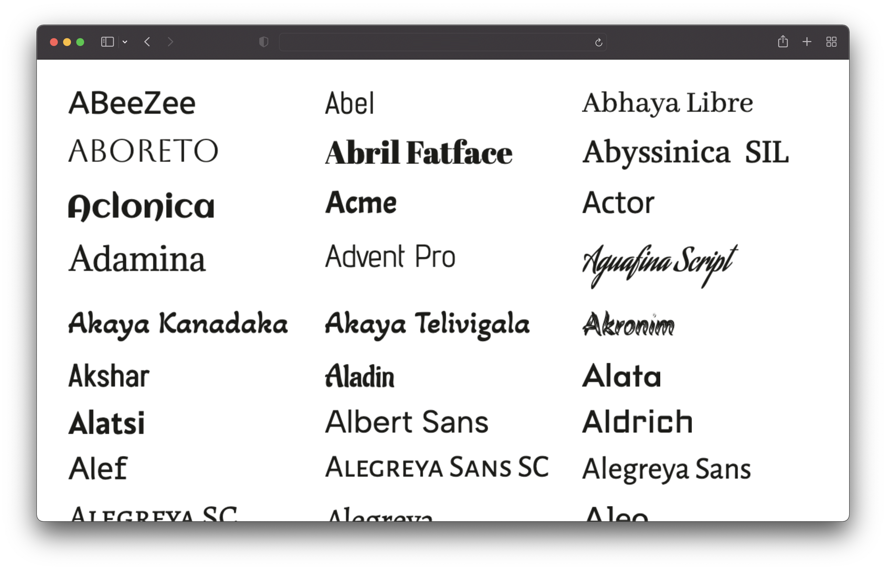

# Google Font Previews

A script to generate preview images of [Google Fonts](https://fonts.google.com).

The generated preview images are available for download in the [Release section](https://github.com/rothsandro/google-fonts-preview/releases).
Or follow the instructions below to generate the preview images yourself.



## Generate images

Clone this repository and run the following commands:

```bash
# 1. Install dependencies
npm install

# 2. Run the script to generate the preview images
npm run generate
```

This will fetch all fonts and generate preview images for all of them. This will take a while (~25min on my machine).
The images will be saved in the `/output/previews` directory.

### Requirements

You need to have [Node.js](https://nodejs.org) v16 or newer installed.

### Configuration

You can customize the previews by editing the `config.json` file:

```json5
{
  // Text of the preview images.
  // If empty, the font name will be used.
  previewText: "",

  // The text color of the preview text.
  textColor: "#1b1b18",

  // The font size of the preview text.
  // Has to be a valid CSS font-size value.
  fontSize: "48px",

  // The format and file extension of the preview images.
  // Either "png" or "jpeg".
  format: "png",

  // The quality of the preview images (only used for JPEG).
  quality: 100,

  // If the background should be transparent (only used for PNG).
  transparent: true,
}
```

## Limitations

Only sans-serif, serif, display, handwriting and monospace fonts are included. Icon fonts are excluded.

## Credits

- [Google Fonts](https://fonts.google.com)
- [@fontsource/google-font-metadata](https://github.com/fontsource/google-font-metadata)
- [@junminahn/node-font2base64](https://github.com/junminahn/node-font2base64)
- [@frinyvonnick/node-html-to-image](https://github.com/frinyvonnick/node-html-to-image)
- [@lovell/sharp](https://github.com/lovell/sharp)
- [@google/zx](https://github.com/google/zx)
